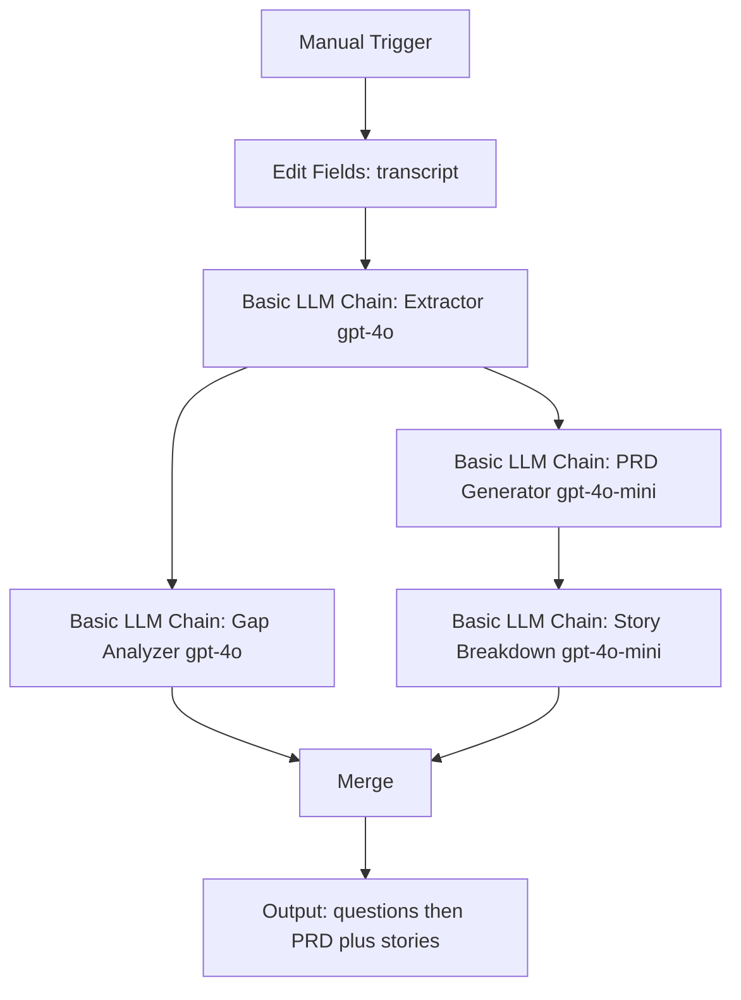

# Orchestration notes

Companion to [docs/architecture-writeup.md](../docs/architecture-writeup.md) and the ADRs. This is the "why sequential + branch" page for the design folder.

## Pattern

**Sequential pipeline + one branch** after extraction.

```
Input text
  → Requirement Extractor
       ├→ Gap Analyzer          → clarification questions (terminal)
       └→ PRD Generator
            → Story Breakdown   → PRD + stories (terminal)
```

Not a router: input type variation is handled inside the Extractor (stated vs ambiguous), not by dispatching to different parsers. Not hierarchical: no supervisor agent.

## Why sequential

Fixed order is the product. You cannot generate a PRD before extraction without inviting hallucination. You cannot break stories before a PRD without losing the template as the contract with engineering. The course brief recommends sequential for that reason; we take it and add one justified deviation (branch placement, ADR-004).

## Why the branch

Gap Analyzer must see extraction, not stories. If it waits until after Story Breakdown (course default), gaps have already been rewritten twice. Parallel with PRD Generator means T11/T12 still run on a full chain for specified inputs, while T2/T5/T9 are graded on the Gap Analyzer output.

The branch is **not** a gate. HITL is simulated: PM takes questions offline, appends answers to the source, re-runs from the Extractor. Stateless by design.

## Agent → model

See ADR-003. Full-tier on Extractor and Gap Analyzer; mini-tier on PRD Generator and Story Breakdown.

## Tool selection table

Copied from the charter so this folder stands alone:

| Category | Choice | Why |
|---|---|---|
| Workflow platform | n8n (IK Cloud) | Cohort instance; sequential + branch; LangFlow-equivalent canvas (ADR-005) |
| LLM — Extractor | Claude or GPT-4o | Stated-vs-ambiguous + contradiction tests (6/12) |
| LLM — Gap Analyzer | Claude or GPT-4o | Same judgment profile |
| LLM — PRD Generator | GPT-4o-mini | Template fill from grounded data |
| LLM — Story Breakdown | GPT-4o-mini | Fixed-format transform |
| Ingestion | n8n Manual Trigger / text | `.txt` / `.md` only |
| Observability | Langfuse | Traces, cost, LLM-as-judge; open/axial coding |
| Output | Markdown / `prd_template.md` | No Docs/Notion required |
| Auth | None in-app | Keys in `.env` only |

## n8n wiring (when building)

IK instance: `https://agenticai100.app.n8n.cloud`. Langfuse: EU `https://cloud.langfuse.com`.  
Follow-along canvas: [prd-genie-n8n-workflow.canvas.tsx](canvases/prd-genie-n8n-workflow.canvas.tsx).

Use **Basic LLM Chain** (or LLM Chain / AI Agent with **zero tools**). Do not attach tools.



TDD order: **Extractor + Langfuse HTTP only** until T1 is green. Then PRD → stories. Then Gap Analyzer branch.

1. Manual Trigger → Edit Fields (`transcript`) → Extractor (prompt from `agents/requirement-extractor.md`, gpt-4o).
2. HTTP Request after Extractor: `POST https://cloud.langfuse.com/api/public/ingestion` **before** the first successful run.
3. Extractor output → Gap Analyzer (full-tier) **and** PRD Generator (mini-tier + `prd_template.md`).
4. PRD Generator output → Story Breakdown (mini-tier).
5. Merge Gap Analyzer + Story Breakdown into two markdown blocks.

Do not add a quality-checker or confidence-scorer agent unless a baseline failure specifically needs it. Extra agents hide the first failure in the chain.
