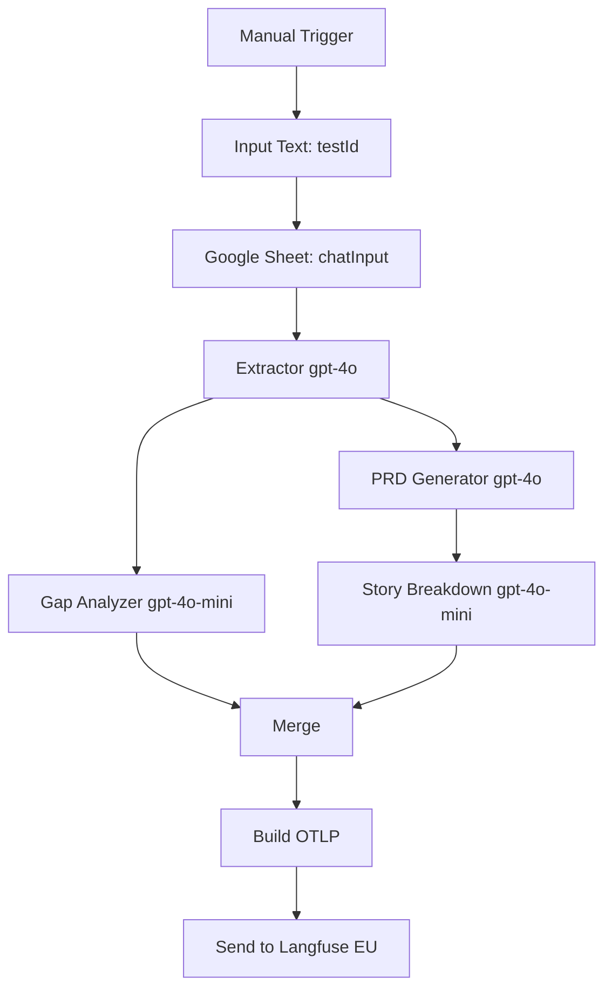

# Orchestration notes

Companion to [docs/architecture-writeup.md](../docs/architecture-writeup.md) and the ADRs. This is the "why sequential + branch" page for the design folder.

Graded canvas: [`system/workflow.json`](../system/workflow.json) (**1.0**). Sticky notes on that import name each agent so a TA does not need a Slack walkthrough. **1.1** (Drive inbox) is an optional enhancement: [enhancement-v1.1-drive-inbox.md](../docs/enhancement-v1.1-drive-inbox.md).

## Pattern

**Sequential pipeline + one branch** after extraction.

```
Input Text.testId → Google Sheet (chatInput)
  → Agent 1 Requirement Extractor
       ├→ Agent 2 Gap Analyzer     → questions (terminal; not a gate)
       └→ Agent 3 PRD Generator
            → Agent 4 Story Breakdown
                 → Merge → Langfuse (four generations)
```

Not a router: input type variation is handled inside the Extractor (stated vs ambiguous), not by dispatching to different parsers. Not hierarchical: no supervisor agent.

## Why sequential

Fixed order is the product. You cannot generate a PRD before extraction without inviting hallucination. You cannot break stories before a PRD without losing the template as the contract with engineering. The course brief recommends sequential for that reason; we take it and add one justified deviation (branch placement, ADR-004).

## Why the branch

Gap Analyzer must see extraction, not stories. If it waits until after Story Breakdown (course default), gaps have already been rewritten twice. Parallel with PRD Generator means T11/T12 still run on a full chain for specified inputs, while T2/T5/T9 are graded on the Gap Analyzer output.

The branch is **not** a gate. HITL is offline: PM takes questions, appends answers to the source, re-runs from the Extractor. Stateless by design. T9 (empty notes) still produces a PRD — that is the Q4 first failure, not a wiring bug. **1.1** (optional) files Unclassified runs into Google Drive with `04-open-items` — [drive-output.md](drive-output.md).

## What each agent does

| Agent | Job | Live model | Must not |
|---|---|---|---|
| 1 Extractor | Stated vs ambiguous; exact numbers | gpt-4o | Invent; pick a side (T3/T6) |
| 2 Gap Analyzer | Questions from the extraction | gpt-4o-mini | Invent answers; stop PRD |
| 3 PRD Generator | Ten template sections | gpt-4o | Pad KPIs; use Gap as new scope |
| 4 Story Breakdown | `As a [persona]`; ACs verbatim | gpt-4o-mini | Paraphrase T4 |

ADR-003 sketched full-tier on Extractor **and** Gap, mini on PRD **and** stories. Live Gap is still mini; live PRD is gpt-4o. Do not “fix” that in the demo week unless a repeated experiment shows a consistent gain.

## Tool selection table

Copied from the charter so this folder stands alone:

| Category | Choice | Why |
|---|---|---|
| Workflow platform | n8n (IK Cloud) | Cohort instance; sequential + branch. 6 Sep: n8n→LangFlow JSON export is broken (ADR-005) |
| LLM — Extractor | gpt-4o | Stated-vs-ambiguous + contradiction tests (6/12) |
| LLM — Gap Analyzer | gpt-4o-mini (live) | Same job; ADR-003 wants gpt-4o |
| LLM — PRD Generator | gpt-4o (live) | Template fill from grounded data |
| LLM — Story Breakdown | gpt-4o-mini | Fixed-format transform |
| Ingestion | Manual Trigger → `testId` → sheet `chatInput` | Official T1–T12 rows, not a pasted sample transcript |
| Observability | Langfuse EU OTLP v4 | Per-agent generations; judges in Langfuse, not n8n |
| Output | Markdown / `prd_template.md` | **1.1** optional: Google Drive Ready vs Unclassified |
| Auth | None in-app | Keys in n8n credentials / `.env` only |

## n8n wiring (1.0 — graded)

IK n8n Cloud for this cohort is **deactivated**. The scored graph is in `system/workflow.json` (1.0). Langfuse: EU `https://cloud.langfuse.com`.  
Follow-along (build-plan canvas, not the live graph): [prd-genie-n8n-workflow.canvas.tsx](canvases/prd-genie-n8n-workflow.canvas.tsx).

Use **Basic LLM Chain** (or LLM Chain / AI Agent with **zero tools**). Do not attach tools. Do not add a judge node.


```mermaid
flowchart TD
  T[Manual Trigger] --> S[Input Text: testId]
  S --> SH[Google Sheet: chatInput]
  SH --> E[Extractor gpt-4o]
  E --> G[Gap Analyzer gpt-4o-mini]
  E --> P[PRD Generator gpt-4o]
  P --> ST[Story Breakdown gpt-4o-mini]
  G --> M[Merge]
  ST --> M
  M --> B[Build OTLP]
  B --> L[Send to Langfuse EU]
```

TDD order (done through Gap): **Extractor + Langfuse HTTP only** until T1 is green. Then PRD → stories. Then Gap Analyzer branch (**1.0**). Drive export is **1.1**, after Langfuse, optional.

1. Manual Trigger → Input Text (`testId`) → Sheet row → Extractor (prompt from `agents/requirement-extractor.md`, gpt-4o).
2. HTTP Request after the Merge: `POST https://cloud.langfuse.com/api/public/otel/v1/traces` with `x-langfuse-ingestion-version: 4` — connected **before** the first successful scored run.
3. Extractor output → Gap Analyzer **and** PRD Generator in parallel (ADR-004).
4. PRD Generator output → Story Breakdown.
5. Merge Gap + stories so one trace has four generations.

Do not add a quality-checker or confidence-scorer agent unless a baseline failure specifically needs it. Extra agents hide the first failure in the chain.
