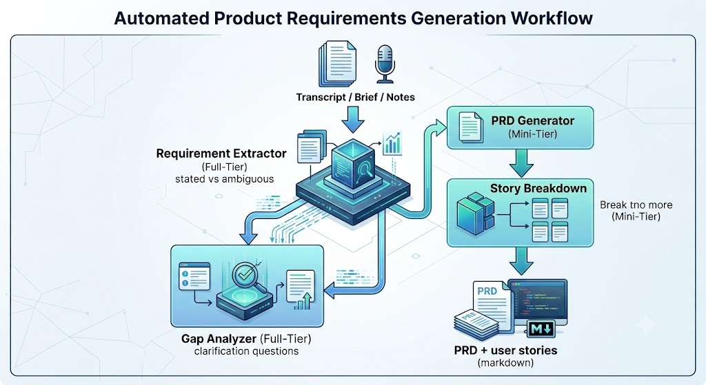

# Q3 Architecture Writeup — PRD Genie

NeuronForge Technologies · Applied Agentic AI for PMs/TPMs Capstone  
Author: Sendil · 1–2 page design / tool rationale / cost  
Decisions: [ADR-001](adr/ADR-001-orchestration-pattern.md) · [ADR-002](adr/ADR-002-extended-capability.md) · [ADR-003](adr/ADR-003-split-model-design.md) · [ADR-004](adr/ADR-004-gap-analyzer-placement.md) · [ADR-005](adr/ADR-005-workflow-platform.md)

## Problem 

PRD Genie turns NeuronForge meeting transcripts, product briefs, and stakeholder notes into a first-draft PRD and user stories so PMs stop hand-mining unstructured discussion. It is for PMs/TPMs who must ship a consistent template to engineering. The biggest risk if the AI is wrong is a hallucinated requirement — a "maybe" or a missing metric treated as committed scope — which is worse than the manual process because it looks like a finished document.

## Design

Four agents. Three are core (Extractor, PRD Generator, Story Breakdown). One is the extended capability (Gap Analyzer).

<div align="center">
  
  <p><em>Automated Product Requirements Generation Workflow.</em><br />
  PNG is the submission visual; <a href="../design/architecture-diagram.svg">architecture-diagram.svg</a> is the structural source.</p>
</div>

Text fallback (same flow):

```
Transcript / brief / notes
        ↓
Requirement Extractor     (full-tier)  stated vs ambiguous
        ↓                         ↓
  Gap Analyzer (full-tier)    PRD Generator (mini-tier)
  clarification questions            ↓
                              Story Breakdown (mini-tier)
                                     ↓
                              PRD + user stories (markdown)
```

**Orchestration is sequential with one branch** (ADR-001). Every input type follows extract → generate → breakdown. A router would add a classification step the baseline dataset does not score. A hierarchical supervisor would hide per-agent failures — the opposite of what Langfuse evaluation needs.

**Gap Analyzer sits after the Extractor, in parallel with PRD generation** (ADR-004). The course diagram parks it after stories. That is too late: an unresolved contradiction would already have been rewritten into a PRD and then into stories. Catching it on the extraction schema is cheaper and is what T2, T3, T5, T6, T9, and T10 actually test. Clarification questions are a terminal output. Human-in-the-loop resume is out of scope; the PM answers offline and re-runs from the Extractor as a fresh, stateless run.

**Hallucination guardrail is in every prompt, not a later filter.** If the input is too vague to determine X, the agent writes UNKNOWN. Empty PRD sections stay under Open Questions. Contradictions are surfaced, never "resolved" by picking a side. Acceptance criteria (T4) are copied verbatim.

## Tool rationale

| Category | Choice | Why |
|---|---|---|
| Workflow platform | n8n (IK Cloud) | Cohort instance at agenticai100.app.n8n.cloud; sequential + one branch maps to AI Agent nodes; rubric accepts LangFlow **or equivalent** canvas ([ADR-005](adr/ADR-005-workflow-platform.md)) |
| LLM — Extractor / Gap Analyzer | Claude or GPT-4o (full tier) | Highest-stakes judgment; 6/12 baseline tests grade this step |
| LLM — PRD Generator / Story Breakdown | GPT-4o-mini | Mechanical fill of a fixed template from already-grounded data |
| Document ingestion | n8n Manual Trigger / text | Inputs are `.txt` / `.md`; no OCR or CSV reshape |
| Observability | Langfuse | Per-agent traces, token cost, LLM-as-judge scores (completeness, hallucination, groundedness); maps to the class open-coding / axial-coding loop |
| Output | Markdown matching `prd_template.md` | Rubric does not require Docs/Notion export |
| Auth | None in-app | File-upload pipeline; provider keys live in env only |

LangFlow was the 30 Aug default and is now the rejected primary: the course **hosts n8n** for this cohort, so the graded canvas is that instance (ADR-005). A coded LangGraph app stays rejected — the capstone scores a visual canvas export plus traces, not a custom runtime.

## Cost analysis (a priori — replace with Langfuse actuals after baseline)

Public list prices used for the estimate (USD / 1M tokens). Lock the exact model IDs in n8n and overwrite this table from traces.

| Model | Input | Output |
|---|---|---|
| GPT-4o (full) | $2.50 | $10.00 |
| GPT-4o-mini | $0.15 | $0.60 |

**Per-run token sketch** (typical T1-sized input, ~400–800 source tokens):

| Agent | In (est.) | Out (est.) | Cost |
|---|---|---|---|
| Extractor (full) | 1,800 | 700 | ~$0.0115 |
| Gap Analyzer (full) | 1,600 | 500 | ~$0.0090 |
| PRD Generator (mini) | 2,200 | 1,200 | ~$0.0011 |
| Story Breakdown (mini) | 1,800 | 900 | ~$0.0008 |
| **Total / run** | | | **~$0.022** |

Split-model vs all-full-tier: the two mini-tier agents would cost ~$0.018 extra per run on GPT-4o. Across 12 baseline inputs that is noise; across **20 PRDs/day × 22 working days** (~440 runs/month) it is ~$8/month saved and, more importantly, it keeps the reasoning budget on the agents the dataset actually tests.

**Volume → cost per user per day** (the unit the session brief asks for):

| Scenario | Volume | Cost |
|---|---|---|
| One PM, 2 first-drafts / day | 2 runs | **~$0.044 / user / day** |
| Team, 20 first-drafts / day | 20 runs | ~$0.44 / day (~$10 / month) |

Re-runs after clarification add Extractor+Gap cost only (stateless full pipeline, not a fourth agent).

These numbers are a ceiling-style sketch. Actuals will be higher on T11/T12 (PRD-length context) and lower on T9 (empty notes). The scored deliverable is `tokens × price × expected daily volume`, expressed per user per day, plus Langfuse screenshots of real totals.

## Evaluation strategy

1. Connect Langfuse **before** the first successful canvas run (not bolted on).
2. Score configs: **completeness**, **hallucination** (untraceable items), **groundedness**.
3. **TDD:** treat each T-row as a failing test. Green one ID (paste output + Pass/Fail) before adding the next agent. Do not run all 12 only after the full graph exists.
4. Open-code failing traces; axial-code into the dataset's own categories (vague, contradictory, incomplete, edge-case, dependency).
5. Change **one** thing per experiment (`evidence/experiment-log.md`), in this order if needed: prompt → model swap → architecture → config → fine-tune. Because outputs are non-deterministic, **re-run the same change several times** and keep it only if the gain is consistent.
6. **Three or more production metrics** (session brief; picked from this project's failure mode — invented requirements):
   1. Hallucination rate (% of items with no evidence quote)
   2. Groundedness (traceable to source)
   3. Format compliance (all 10 template sections present)
   Plus operational: tokens and latency per run. Business: PM drafting time saved per first-draft PRD.

Baseline results and the experiment log are empty of scores until Days 9–11 of the build. The strategy above is what Q3 asks for; Q4 reflection fills in what the traces actually showed.
